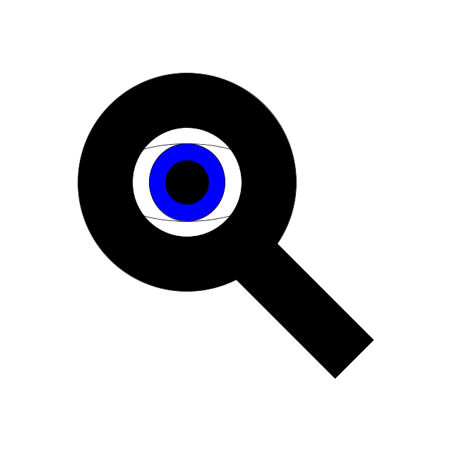

# 📱 I Spy

**Created:** March 2026 - May 2026

**Skills Used:** 
- Dart
- Flutter
- Visual Studio Code
- Github
- Figma

**Genre:** Android Mobile Arcade Game

**Description:** I Spy is a game where players take pictures of a specified color and score points.

**Where to view:**  <a href="https://youtube.com/shorts/KSWXoz0LRQ0">https://youtube.com/shorts/KSWXoz0LRQ0</a>

**Development:** 

I am the sole developer and designer of this project. I created UI mockups in Figma to guide the structure and layout of the app before implementing the interface in Flutter. The app integrates the camera to take pictures and calculate the average color. Along with sharedPreferences to make a local leader board. There are also sound effects as well.
